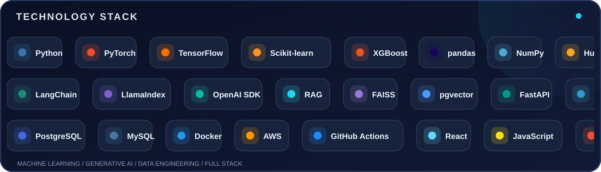

<div align="center">

<!-- Animated header -->


<a href="https://git.io/typing-svg"></a>

[](https://syed-badi-uz-zaman-shah.syedbadi-shah66.workers.dev/)
[](https://www.linkedin.com/in/syed-badiuzzaman/)
[](mailto:syedbadi.shah66@gmail.com)

**📍 Islamabad, Pakistan** · **🎓 BS Computer Science — Quaid-e-Azam University**

</div>

---

### 👨‍💻 About me

I'm a **Computer Science graduate focused on AI engineering, machine learning, data science, and generative AI**. I build practical, end-to-end solutions: preparing data, training and evaluating models, exposing APIs, and shipping user-facing applications.

- 🧠 **AI & LLMs:** RAG, embeddings, vector search, LangChain, LlamaIndex and transformer workflows.
- 📈 **Applied ML:** time-series feature engineering, predictive modeling, experiment tracking and evaluation.
- 🛠️ **Engineering:** Python, FastAPI, SQL, Docker, CI/CD and React-based interfaces.
- 🎯 **Current focus:** improving retrieval evaluation, reliable AI applications and production model serving.

### ⚡ Animated tech stack

<div align="center">
  
</div>

<details>
<summary><b>View technology stack by category</b></summary>

| Area | Technologies & approaches |
| :-- | :-- |
| **Languages & frontend** | Python, SQL, JavaScript (ES6+), React, HTML5, CSS3 |
| **Data science & ML** | pandas, NumPy, scikit-learn, XGBoost, Matplotlib, feature engineering, model evaluation |
| **Deep learning** | PyTorch, TensorFlow, Hugging Face Transformers |
| **LLMs & retrieval** | LangChain, LlamaIndex, OpenAI SDK, RAG, FAISS, pgvector, prompt engineering |
| **Databases** | PostgreSQL, MySQL, indexing, joins, window functions, query optimization |
| **Backend & MLOps** | FastAPI, MLflow, Docker, GitHub Actions, AWS S3 / SageMaker |
| **Workflow** | Git, GitHub, Jupyter, VS Code, uv |

</details>

### 🚀 Featured work

<table>
<tr>
<td width="50%" valign="top">

#### 🏥 Health Care GPT
**Patient-scoped retrieval augmented generation**

A medical-history RAG project focused on access-controlled retrieval and citation-bound summaries.

- Embedding, chunking and hybrid-retrieval pipeline
- PostgreSQL + pgvector and FastAPI + JWT authorization
- Retrieval and adversarial safety evaluation assets

**Stack:** Python · FastAPI · pgvector · Sentence Transformers · Gemini

[**View repository →**](https://github.com/SyedBadiuzzaman/health_care_gpt)
</td>
<td width="50%" valign="top">

#### 📊 EQAP
**Quantitative analytics & predictive modeling**

End-to-end financial time-series modeling across multiple tickers and asset types.

- Five years of historical market data
- 200 technical and rolling statistical indicators
- ML workflows, MLflow tracking and prediction APIs
- React-based exploration and forecast dashboard

**Stack:** Python · XGBoost · scikit-learn · PostgreSQL · MLflow · FastAPI · React

[**Backend →**](https://github.com/SyedBadiuzzaman/EQAP_Backend) · [**Frontend →**](https://github.com/SyedBadiuzzaman/EQAP_FrontEnd)
</td>
</tr>
<tr>
<td width="50%" valign="top">

#### 🔍 Exploratory Data Analysis
**Data exploration & reproducible notebooks**

A collection of Jupyter notebooks exploring datasets and practicing analysis workflows.

**Stack:** Python · Jupyter · pandas · NumPy

[**Explore notebooks →**](https://github.com/SyedBadiuzzaman/EDA-s)
</td>
</tr>
</table>

### 🔬 How I build AI systems

```text
Business problem → Data collection & cleaning → Feature engineering
             → Model / RAG pipeline → Evaluation
             → FastAPI serving → UI / deployment → Monitoring & iteration
```

### 📈 GitHub activity

<div align="center">
  
  
</div>

> **Interested in practical AI products, robust RAG systems, and end-to-end machine learning engineering.**

<div align="center">

### 🤝 Let's connect

[**Portfolio**](https://syed-badi-uz-zaman-shah.syedbadi-shah66.workers.dev/) · [**LinkedIn**](https://www.linkedin.com/in/syed-badiuzzaman/) · [**Email**](mailto:syedbadi.shah66@gmail.com) · [**GitHub**](https://github.com/SyedBadiuzzaman)


</div>
